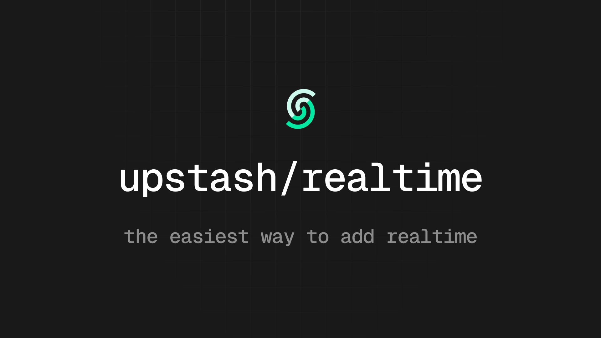

# Realtime

The easiest way to add realtime features to any Next.js project.

## Features

- ⏰ Setup takes 60 seconds
- 🧨 Clean APIs & first-class TypeScript support
- ⚡ Extremely fast, zero dependencies, 1.9kB gzipped
- 💻 Deploy anywhere: Vercel, Netlify, etc.
- 💎 100% type-safe with zod 4 or zod mini
- ⏱️ Built-in message histories
- 🔌 Automatic connection management w/ delivery guarantee
- 🔋 Built-in middleware and authentication helpers
- 📶 100% HTTP-based: Redis streams & SSE

---

## Quickstart

Check out the examples in the repository to get started.
